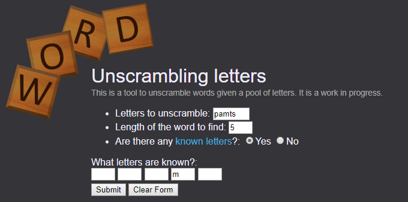

# word-unscrambler

Currently hosted <a href="http://sheyin.pythonanywhere.com/">here</a>.

I started writing this up when I was stumped playing "WordScapes" on iOS.  The premise of that game is that you have a pool of letters to unscramble and form words that fit on a crossword grid.  However, one of the things that frustrated me is that it does not follow "Scrabble rules" - ie. some abbreviations/slang is allowed, etc.  So simply matching up words against a dictionary might not work as well, though I'm sure one exists that would go through this process in a more logical manner.

This has been redesigned to list all possible combinations, and remove results based on certain criteria.  The results that are left are considered to be most likely a word if they
also match a postfix defined in word.py.  For the remaining results, a reason is displayed for why it was removed from the "most likely" results.

Features:
- Determines all combinations of letters and promotes results if matching postfixes
- Filters some junk results based on lack of vowels, unusual starting letters, duplicate entries
- Performs input validation and returns error messages

Things to add:
- Improving algorithm to remove more junk results

Bugs:
- Fixed the ones I know about - let me know if you find more!

Usage:
It is currently hosted <a href="http://sheyin.pythonanywhere.com/">here</a>.

To run it yourself, <a href="http://flask.pocoo.org/">Flask</a> needs to be installed.  On Windows, set FLASK_APP to <b>main.py</b>, then running flask by entering <b>flask run</b>.

Screenshots:  
  
  
